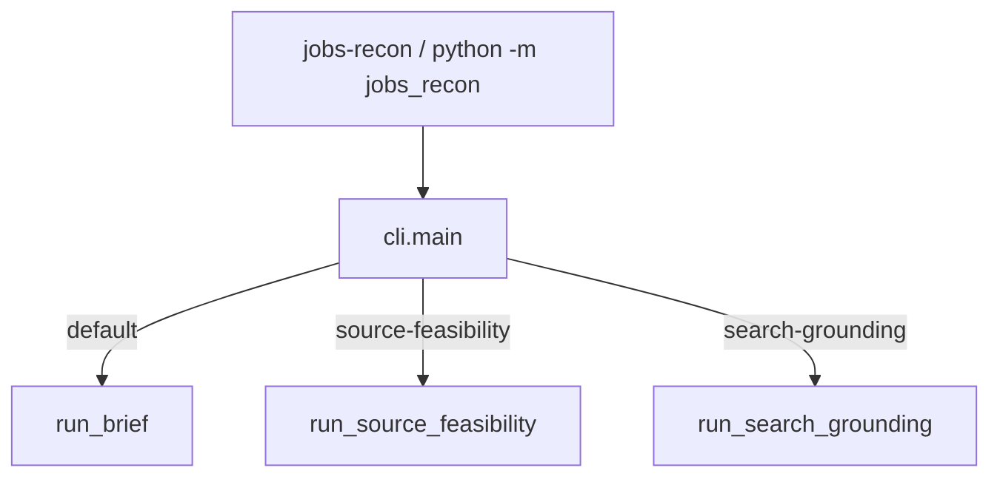
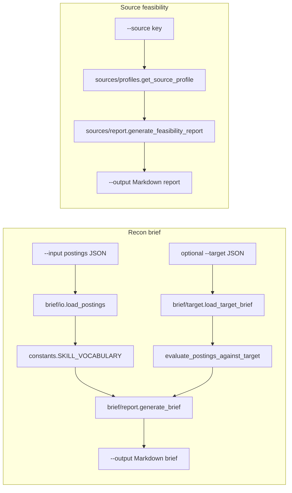
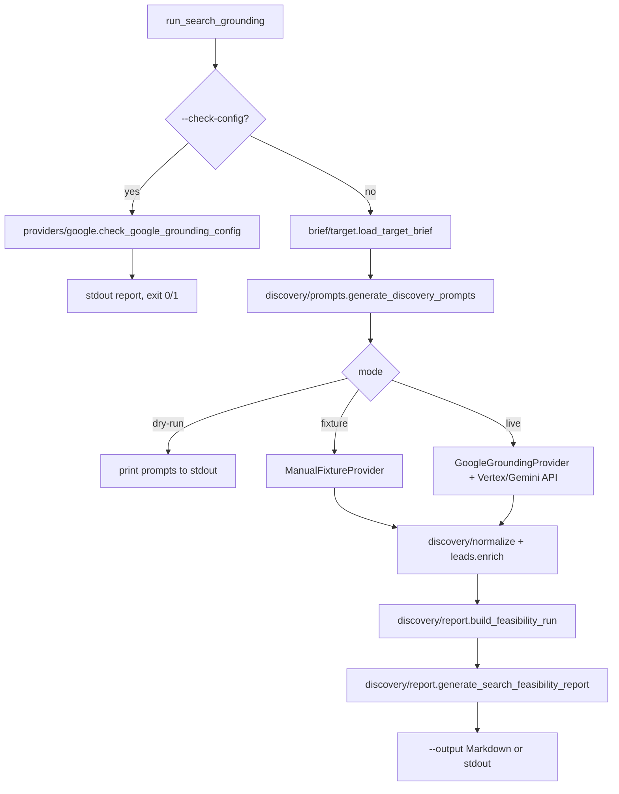

# Jobs Recon

CLI-first job-market reconnaissance. Parse local postings, run scoped recon passes, and export Obsidian-friendly Markdown briefs and feasibility reports.

See [CHANGELOG.md](CHANGELOG.md) for milestone history.

---

## Table of contents

- [Getting started](#getting-started)
- [Project layout](#project-layout)
- [Application flow](#application-flow)
- [Commands](#commands)
  - [Recon brief (local postings)](#recon-brief-local-postings)
  - [Source feasibility](#source-feasibility)
  - [Search grounding (Vertex / Gemini)](#search-grounding-vertex--gemini)
- [Tests](#tests)
- [Input format](#input-format)
- [License](#license)

---

## Getting started

### Prerequisites

- Python 3.10+
- [uv](https://github.com/astral-sh/uv)

### Install

```bash
git clone https://github.com/Trevor5008/Jobs-Recon.git
cd Jobs-Recon
uv sync --all-extras
```

Run commands with `uv run jobs-recon ...` so the project virtualenv and package are used. 
- Plain `python -m jobs_recon` only works inside an activated `.venv` after `uv sync`.

### Run your first recon brief

Generate a Markdown brief from the sample postings file:

```bash
uv run jobs-recon \
  --input examples/sample_postings.json \
  --output output/recon_brief.md
```

Open `output/recon_brief.md` — it lists repeated skills, posting notes, and next actions.

To scope the brief against a target (title keywords, locations, required skills):

```bash
uv run jobs-recon \
  --input examples/sample_postings.json \
  --target examples/target_brief.json \
  --output output/recon_brief.md
```

### Optional: Vertex grounding setup

For live `search-grounding`, copy `.env.example` to `.env` and set:

```bash
GOOGLE_GENAI_USE_VERTEXAI=true
GOOGLE_CLOUD_PROJECT=your-project
GOOGLE_CLOUD_LOCATION=us-central1
GOOGLE_APPLICATION_CREDENTIALS=/path/to/gcp-credentials.json
```

Verify config without an API call:

```bash
uv run jobs-recon search-grounding --check-config
```

See [Search grounding](#search-grounding-vertex--gemini) for dry-run, fixture, and live workflows.

### Verify the install

```bash
uv run pytest
```

## Project layout

Feature subpackages mirror the three CLI commands. _Shared types live at the package root_

```
src/jobs_recon/
├── cli.py                 # argparse router and run_* dispatch
├── models.py              # JobPosting, TargetBrief, TargetMatch (shared)
├── brief/                 # default command — local postings → Markdown brief
│   ├── io.py              # load postings from JSON
│   ├── target.py          # load target brief, evaluate matches
│   └── report.py          # generate_brief
├── sources/               # source-feasibility
│   ├── profiles.py        # static source profiles (e.g. Handshake)
│   └── report.py          # feasibility Markdown
└── discovery/             # search-grounding command
    ├── types.py           # DiscoveryLead, constants
    ├── prompts.py         # target-aware grounded-search prompts
    ├── leads.py           # URL classification and enrichment
    ├── normalize.py       # fixture / API response normalization
    ├── report.py          # search feasibility Markdown
    └── providers/         # google (Vertex/Gemini), fixture
        ├── google.py
        ├── fixture.py
        └── protocol.py

tests/
├── brief/
├── discovery/
├── sources/
└── fixtures/
```

| CLI command | Package | Role |
|---|---|---|
| default (recon brief) | `brief/` | Parse postings, score against target, render brief |
| `source-feasibility` | `sources/` | Source profiles and feasibility reports |
| `search-grounding` | `discovery/` | Prompts, grounding providers, lead normalization, reports |

## Application flow

Jobs Recon is a CLI router with three independent recon passes. Each pass reads local inputs (and optionally calls Vertex for discovery), then writes Obsidian-friendly Markdown. All paths load `.env` via `load_dotenv()` at CLI import; shared types live in `models.py` (`JobPosting`, `TargetBrief`, `TargetMatch`).



### Recon brief and source feasibility



Source feasibility uses static profiles only — no external API calls.

### Search grounding



Fixture and live paths run the **first prompt only** (`prompts[:1]`). `--check-config` cannot be combined with `--dry-run`, `--fixture`, `--live`, or `--output`. Discovery reuses `load_target_brief` from `brief/target.py` for target JSON.

**Inputs:** postings JSON, target brief JSON, optional fixture JSON, `.env` for live Vertex.

**Outputs:** Markdown recon brief, source feasibility report, or search feasibility report.

## Commands

### Recon brief (local postings)

```bash
uv run jobs-recon --input examples/sample_postings.json --output output/recon_brief.md
```

With target scope:

```bash
uv run jobs-recon \
  --input examples/sample_postings.json \
  --target examples/target_brief.json \
  --output output/recon_brief.md
```

### Source feasibility

```bash
uv run jobs-recon source-feasibility --source handshake --output output/handshake_feasibility.md
```

### Search grounding (Vertex / Gemini)

Grounding finds cited leads. Static feasibility triage classifies lead actionability. Recon briefs analyze actual imported/pasted postings.

Check config (no API call):

```bash
uv run jobs-recon search-grounding --check-config
```

Dry-run prompts:

```bash
uv run jobs-recon search-grounding --target examples/target-ai-engineer.json --dry-run
```

Fixture report:

```bash
uv run jobs-recon search-grounding \
  --target examples/target-ai-engineer.json \
  --fixture tests/fixtures/google_grounding_response.json \
  --output output/google_grounding_feasibility.md
```

Live Vertex grounding:

```bash
uv run jobs-recon search-grounding \
  --target examples/target-ai-engineer.json \
  --live \
  --output output/google_grounding_feasibility_live.md
```

Vertex env vars: 
- `GOOGLE_GENAI_USE_VERTEXAI`, 
- `GOOGLE_CLOUD_PROJECT`, 
- `GOOGLE_CLOUD_LOCATION`, 
- `GOOGLE_APPLICATION_CREDENTIALS`, 

Optional:
- `GEMINI_MODEL` (default `gemini-2.5-flash`).

Grounded results are discovery evidence only — resolve canonical employer/ATS URLs before import.

## Tests

```bash
uv run pytest
```

Target briefs: 
- `examples/target_brief.json`, 
- `examples/target-ai-engineer.json`

---
## License

MIT — see [LICENSE](LICENSE).
